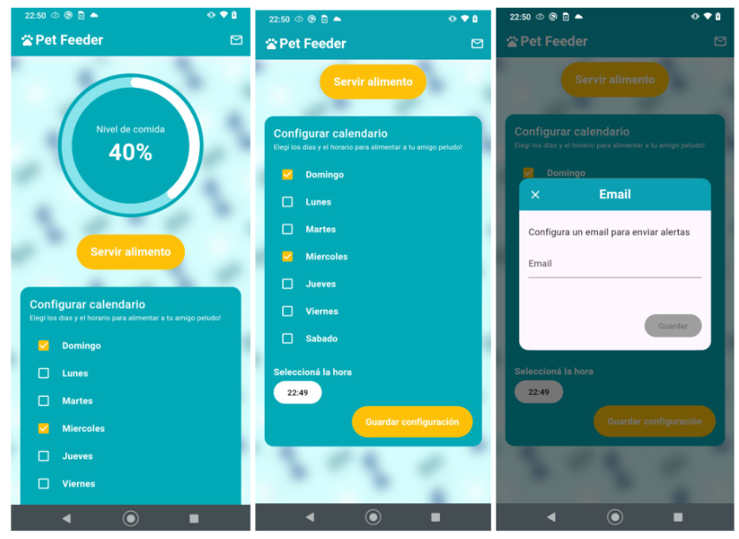

# Pet Feeder App

This is an IoT app created to easily configure a feed calendar for a pet and to feed it on demand. You'll be able to quickly see the food level in real time. Also, you can subscribe to receive notifications on your email to notice when the feeder is empty.

